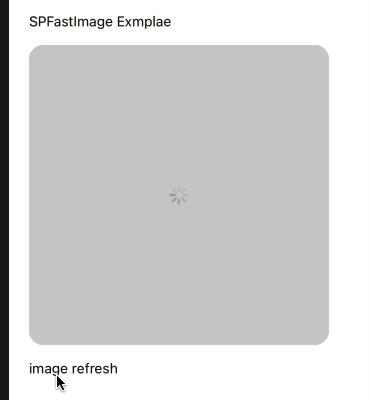

# react-native-helpers

## IMAGE HELPERS



#### Pre-required modules;

`yarn add react-native-fast-image`

### Example SPFastImage loading + auto height

```
const [time, setTime] = useState(Date.now());
    
<SPFastImage
source={{uri: 'https://www.gstatic.com/webp/gallery/5.jpg?t=' + time}}
width={200}
/>
```

### Example SPFastImage loading(width,height)

```
<SPFastImage
    source={{uri: 'https://www.gstatic.com/webp/gallery/5.jpg?t=' + time}}
    style={{
        borderRadius: 15,
        height: 200,
        width: 200,
    }}
    resizeMode={'cover'}
/>
```

### Example SPFastImage loading(aspectRatio)

```
<SPFastImage
    source={{uri: 'https://www.gstatic.com/webp/gallery/5.jpg?t=' + time}}
    style={{
        borderRadius: 15,
        aspectRatio: 375 / 300 // or 4/3 or 4/4
    }}
    resizeMode={'cover'}
/>
```

### Example SPImageBackground


```
<SPImageBackground
    style={{flex: 1}} source={{uri: 'https://www.gstatic.com/webp/gallery/5.jpg?t=' + time}}
    resizeMode={'cover'}
>
  children
</SPImageBackground>
```


## BasicTimer


```
<BasicTimer duration={10} complete={() => alert('completed')}>
    {
        (time) => (
            <Text>{time} seconds</Text>
        )
    }
</BasicTimer>
```

## GLOBAL HELPERS

|Key |Type |Description |
|--- |--- |--- |
|`screenWidth`|function|screen Width|
|`screenHeight`|function|screen Height |
